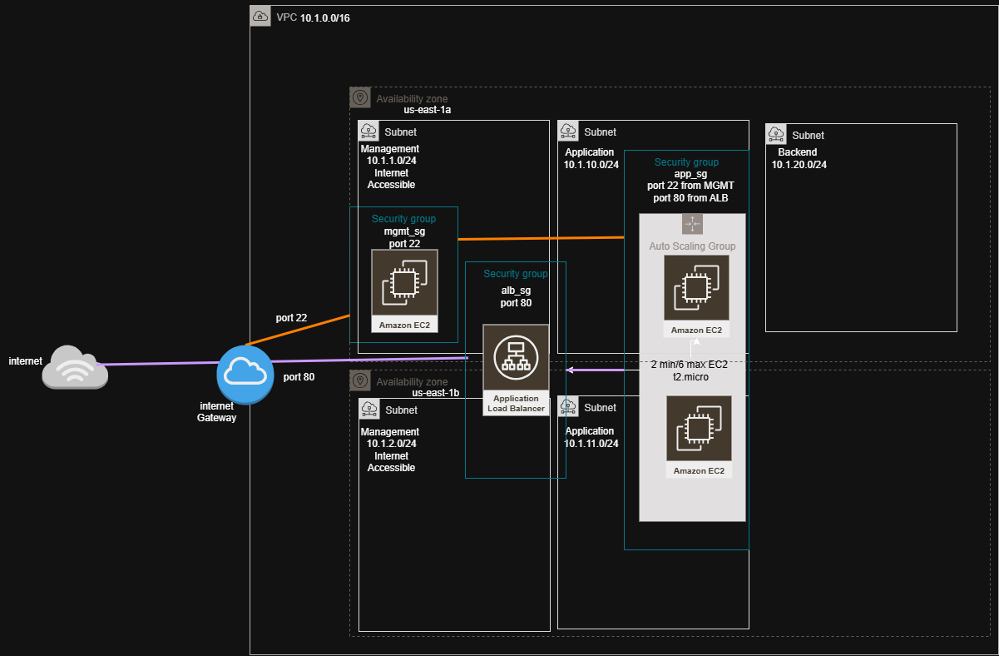

# tech-challenge-2025
SRE AWS Technical Challenge

### References
https://github.com/Coalfire-CF
https://registry.terraform.io/

<!-- BEGIN_TF_DOCS -->
## Requirements

| Name | Version |
|------|---------|
|  [terraform](#requirement\_terraform) | >= 1.5 |
|  [aws](#requirement\_aws) | ~> 5.0 |

## Providers

| Name | Version |
|------|---------|
|  [aws](#provider\_aws) | 5.100.0 |

## Modules

| Name | Source | Version |
|------|--------|---------|
|  [management\_ec2](#module\_management\_ec2) | github.com/Coalfire-CF/terraform-aws-ec2 | main |

## Resources

| Name | Type |
|------|------|
| [aws_autoscaling_group.app_asg](https://registry.terraform.io/providers/hashicorp/aws/latest/docs/resources/autoscaling_group) | resource |
| [aws_eip.nat](https://registry.terraform.io/providers/hashicorp/aws/latest/docs/resources/eip) | resource |
| [aws_internet_gateway.igw](https://registry.terraform.io/providers/hashicorp/aws/latest/docs/resources/internet_gateway) | resource |
| [aws_key_pair.management](https://registry.terraform.io/providers/hashicorp/aws/latest/docs/resources/key_pair) | resource |
| [aws_launch_template.app_lt](https://registry.terraform.io/providers/hashicorp/aws/latest/docs/resources/launch_template) | resource |
| [aws_lb.app_alb](https://registry.terraform.io/providers/hashicorp/aws/latest/docs/resources/lb) | resource |
| [aws_lb_listener.http](https://registry.terraform.io/providers/hashicorp/aws/latest/docs/resources/lb_listener) | resource |
| [aws_lb_target_group.app_tg](https://registry.terraform.io/providers/hashicorp/aws/latest/docs/resources/lb_target_group) | resource |
| [aws_nat_gateway.nat](https://registry.terraform.io/providers/hashicorp/aws/latest/docs/resources/nat_gateway) | resource |
| [aws_route_table.private](https://registry.terraform.io/providers/hashicorp/aws/latest/docs/resources/route_table) | resource |
| [aws_route_table.public](https://registry.terraform.io/providers/hashicorp/aws/latest/docs/resources/route_table) | resource |
| [aws_route_table_association.mgmt_assoc](https://registry.terraform.io/providers/hashicorp/aws/latest/docs/resources/route_table_association) | resource |
| [aws_route_table_association.private](https://registry.terraform.io/providers/hashicorp/aws/latest/docs/resources/route_table_association) | resource |
| [aws_security_group.alb_sg](https://registry.terraform.io/providers/hashicorp/aws/latest/docs/resources/security_group) | resource |
| [aws_security_group.app_sg](https://registry.terraform.io/providers/hashicorp/aws/latest/docs/resources/security_group) | resource |
| [aws_security_group.mgmt_sg](https://registry.terraform.io/providers/hashicorp/aws/latest/docs/resources/security_group) | resource |
| [aws_subnet.app](https://registry.terraform.io/providers/hashicorp/aws/latest/docs/resources/subnet) | resource |
| [aws_subnet.backend](https://registry.terraform.io/providers/hashicorp/aws/latest/docs/resources/subnet) | resource |
| [aws_subnet.management](https://registry.terraform.io/providers/hashicorp/aws/latest/docs/resources/subnet) | resource |
| [aws_vpc.main](https://registry.terraform.io/providers/hashicorp/aws/latest/docs/resources/vpc) | resource |
| [aws_vpc_endpoint.s3](https://registry.terraform.io/providers/hashicorp/aws/latest/docs/resources/vpc_endpoint) | resource |
| [aws_ami.amazon_linux_2](https://registry.terraform.io/providers/hashicorp/aws/latest/docs/data-sources/ami) | data source |
| [aws_availability_zones.available](https://registry.terraform.io/providers/hashicorp/aws/latest/docs/data-sources/availability_zones) | data source |
| [aws_kms_key.ebs](https://registry.terraform.io/providers/hashicorp/aws/latest/docs/data-sources/kms_key) | data source |

## Inputs

| Name | Description | Type | Default | Required |
|------|-------------|------|---------|:--------:|
|  [allowed\_mgmt\_ip](#input\_allowed\_mgmt\_ip) | CIDR allowed to SSH to management instance | `string` | `"203.0.113.5/32"` | no |
|  [app\_subnet\_cidrs](#input\_app\_subnet\_cidrs) | Application subnet CIDRs (private) - provide two to spread across two AZs | `list(string)` | <pre>[   "10.1.10.0/24",   "10.1.11.0/24" ]</pre> | no |
|  [asg\_desired](#input\_asg\_desired) | ASG desired capacity | `number` | `2` | no |
|  [asg\_max](#input\_asg\_max) | ASG max size | `number` | `6` | no |
|  [asg\_min](#input\_asg\_min) | ASG minimum size | `number` | `2` | no |
|  [aws\_region](#input\_aws\_region) | AWS region to deploy into | `string` | `"us-east-1"` | no |
|  [azs](#input\_azs) | Two availability zones to use (order matters) | `list(string)` | <pre>[   "us-east-1a",   "us-east-1b" ]</pre> | no |
|  [backend\_subnet\_cidrs](#input\_backend\_subnet\_cidrs) | Backend subnet CIDRs (private) | `string` | `"10.1.20.0/24"` | no |
|  [ec2\_instance\_type](#input\_ec2\_instance\_type) | EC2 instance type | `string` | `"t2.micro"` | no |
|  [key\_name](#input\_key\_name) | EC2 Key pair name for SSH access | `string` | `"management-key"` | no |
|  [key\_path](#input\_key\_path) | EC2 Key local path | `string` | `"management-key"` | no |
|  [management\_subnet\_cidrs](#input\_management\_subnet\_cidrs) | Management subnet CIDRs (public) - provide two to spread across two AZs | `list(string)` | <pre>[   "10.1.1.0/24",   "10.1.2.0/24" ]</pre> | no |
|  [vpc\_cidr](#input\_vpc\_cidr) | VPC CIDR | `string` | `"10.1.0.0/16"` | no |

## Outputs

| Name | Description |
|------|-------------|
|  [alb\_dns\_name](#output\_alb\_dns\_name) | Application Load Balancer DNS |
|  [app\_subnet\_ids](#output\_app\_subnet\_ids) | Application subnet ids (private) |
|  [backend\_subnet\_ids](#output\_backend\_subnet\_ids) | Backend subnet ids (private) |
|  [management\_subnet\_id](#output\_management\_subnet\_id) | Management subnet id (public) |
|  [vpc\_id](#output\_vpc\_id) | VPC id |
<!-- END_TF_DOCS -->